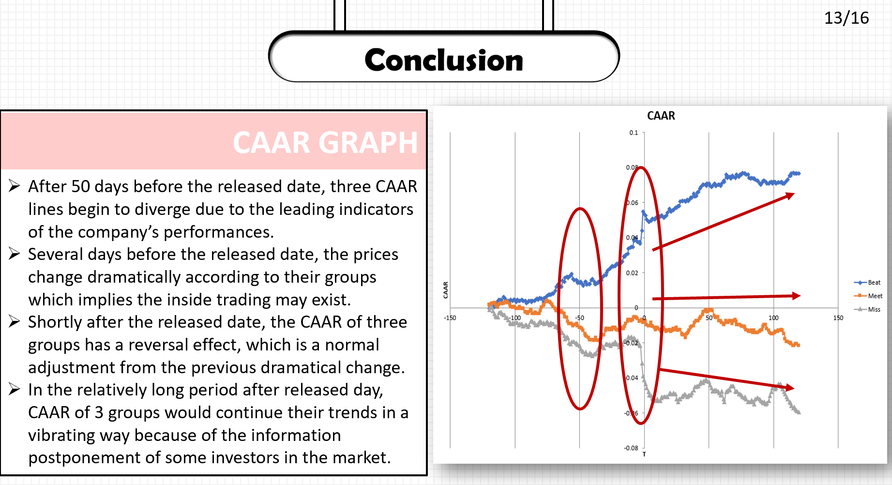

# School Quant Projects

Projects I have done in school or just out of my interests

## Credit Spread Prediction

Credit Spread indicates the risk premium of a risky security, which can serve as a measure of economic uncertainty. Successful prediction of movements in credit spread makes it possible for investors to develop profitable trading strategies.

In this report of Credit-Spread-predicting-machine-learning, we selected various features with high predictive power on economic uncertainty, to be able to predict credit spread. We developed a pipeline for data preprocessing and feature engineering. We also used Hidden Markov Model to detect market regime shifting. Then, we developed an XGBoost model that proved to be more effective when compared to our linear regression benchmark model. Based on our prediction, we built a trading strategy on the correlated ETF.

## C++_Final_Projects: EPS Surprise Effect
C++_Final_Projects analyzes the EPS surprise effect on stock prices, in which crawler are used to parse data from Yahoo finance

## Implied Volitility Marking and Visulization

Implied volatility surface is a python python project parsing data from Yahoo finance and visualizing the implied volatility surface of the option I am interested in. Used for marking the implied volatility.

## PricebyCRR 

Price European options with CRR - Cox-Ross-Rubinstein market model 
